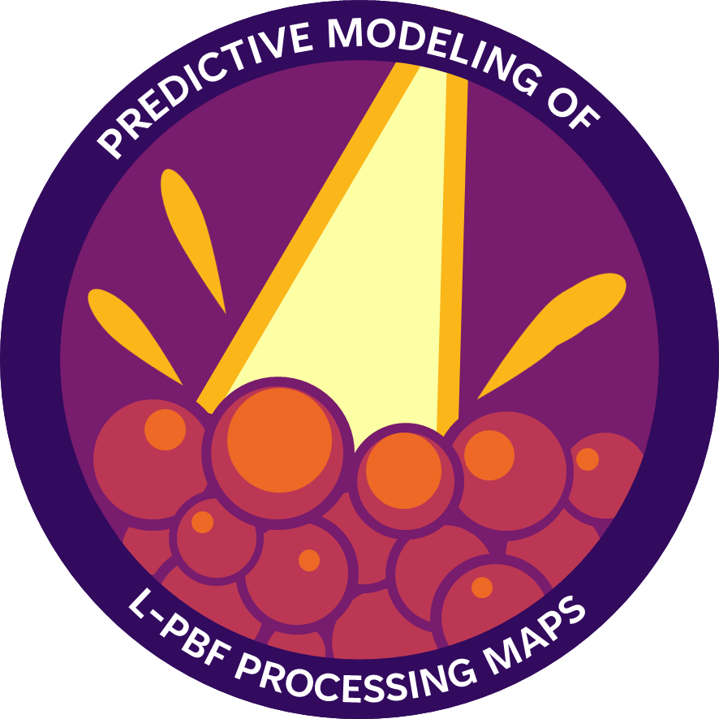

# Predictive Modeling of L-PBF Processing Maps

> **⚠️ WORK IN PROGRESS** > This project is currently under active development. The code, documentation, and results are subject to change.

  

## 📖 Overview
This personal project focuses on the development of a predictive model for **Laser Powder Bed Fusion (L-PBF)** processing maps. The goal is to minimize the extensive experimental workload typically required for parameter optimization in additive manufacturing.

By establishing relationships between processing parameters (laser power, scanning speed, etc.) and melt pool characteristics, this tool predicts optimal processing windows to ensure high-quality part fabrication for specific materials.

## 🚀 Key Features
The model utilizes analytical solutions to estimate melt pool dimensions and evaluate defect criteria:

* **Melt Pool Estimation**:
    * **Width & Length**: Calculated using the **Eagar-Tsai model**, which assumes a traveling **Gaussian-distributed heat source** on a semi-infinite substrate.
    * **Depth**: Estimated using the **Gladush-Smurov model** to account for deep-penetration physics (keyhole mode) often seen in L-PBF.
* **Defect Prediction**:
    * **Balling**: Evaluated using **Yadroitsev’s criteria** (melt pool stability).
    * **Keyhole Porosity**: Predicted using **Rubenchik’s criteria** based on normalized enthalpy.
    * **Lack of Fusion**: Assessed using **Seede’s criteria** regarding hatch spacing and layer overlap.

## 📂 Repository Structure
The project is organized as follows:

* `src/`: Core Python modules for physics calculations and plotting.
    * `physics.py`: Contains the implementation of Eagar-Tsai and Gladush-Smurov models.
    * `data_loader.py`: Handles loading of material properties.
    * `plots.py`: Visualization tools for processing maps.
* `materials/`: JSON files containing thermophysical properties for alloys (e.g., `Ti64.json`, `NiTi.json`).
* `notebooks/`: Jupyter notebooks demonstrating usage (see `example.ipynb`).
* `images/`: Generated plots and illustrations.

## 🛠️ Usage
*Current status: The code is functional but being refined.*

To see the model in action, refer to the **[notebooks/example.ipynb](notebooks/example.ipynb)** file, which demonstrates how to load material data and generate a processing map.

## 📝 Documentation & Reporting
A comprehensive report detailing the mathematical derivations (including Green's function integration for the Gaussian source), scaling laws, and validation against literature is currently being finalized.
* **Report Status**: To be added upon project completion.

## 👤 Author
**Ilídio Costa** *Personal Project*